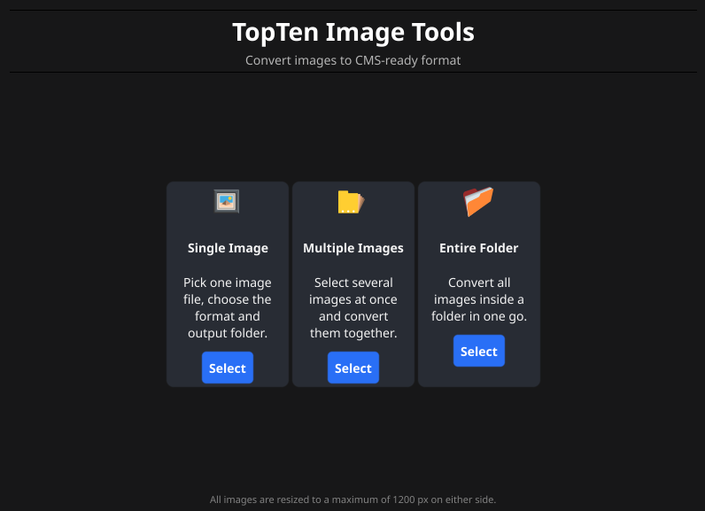

# Topten Image Tools — User Guide

This guide walks you through everything you need to know to convert images using Topten Image Tools. No technical knowledge is needed.

---

## What does this app do?

Topten Image Tools prepares your images so they are ready to upload to the CMS. It does two things automatically:

1. **Converts** your images to the right file format (JPG or PNG).
2. **Resizes** them so they are never wider or taller than 1 200 pixels — the maximum size the CMS needs. If your image is already small enough, it will not be changed in size.

Your original files are **never modified or deleted**. The app always creates new converted copies.

---

## Opening the app

| Platform | How to open |
|---|---|
| **macOS** | Double-click **Topten Image Tools** in your Applications folder (or wherever you saved it) |
| **Windows** | Double-click **topten-image-tools.exe** |
| **Linux** | Double-click the file or run it from your file manager |

When the app opens you will see the **home screen** with three options.

---

## Step 1 — Choose what you want to convert

Pick the option that matches your situation:

---

### 🖼 Single Image

Use this when you have **one image** to convert.

1. Click **Select**.
2. A file browser opens — navigate to your image and click **Open**.
3. The file name appears in the list. Click **Next →** to continue.

---

### 🗂 Multiple Images

Use this when you have **a handful of images** from different folders, or when you want to pick and choose which files to include.

1. Click **Select**.
2. Click **Add Image** and pick your first image.
3. Click **Add Image** again for each additional image you want to add. Build up the list one file at a time.
4. Once all your images are listed, click **Next →** to continue.

> **Tip:** If you accidentally add the wrong file, click **Clear** to start the list over.

---

### 📁 Entire Folder

Use this when you want to convert **all images inside one folder** at the same time.

1. Click **Select**.
2. A folder browser opens — navigate to the folder that contains your images and click **Open**.
3. The app will list every image it found. Click **Next →** to continue.

> **Note:** Only the top-level images in the folder are included. Images inside sub-folders are not processed.

---

## Step 2 — Choose the right format

The app shows you three options. Click **Select** next to the one that fits your images:

| Option | When to use it |
|---|---|
| 📷 **JPEG** | Photos, landscapes, product shots, anything with lots of colours or gradients. Produces the smallest files. |
| ✏️ **PNG** | Graphics with text or logos, screenshots, infographics, or anything with a transparent background. Lossless — no quality is lost. |
| ⚡ **Use defaults** | Not sure? This picks JPEG and works well for most images. |

Clicking **Select** on any card moves you straight to the next step — there are no extra questions.

> **Transparent images:** If the app detects that one or more of your source files has a transparent background, a note will appear on the JPEG card. If you proceed with JPEG, the transparent areas will be filled with a **white background** — JPEG does not support transparency. Choose PNG instead if you need the transparency to be kept.

---

## Step 3 — Choose where to save the converted files

The app suggests saving the converted images in the **same folder as your original files** — this is usually the most convenient option.

- If that is fine, just click **Convert Now**.
- If you want to save them somewhere else (for example, a dedicated "CMS uploads" folder), click **Browse…**, navigate to the folder you want, and then click **Convert Now**.

> **Tip:** Saving to a separate folder keeps your originals and converted files neatly apart and makes it easy to find what to upload.

---

## Step 4 — Conversion in progress

A progress bar shows how far along the conversion is.

- Each file is shown by name as it is processed.
- If something goes wrong with a single file (for example, the file is corrupted), a warning appears for that file but the rest will still be converted.
- If you need to stop, click **Cancel** — no files will be left in a broken state.

---

## Step 5 — Results

When the conversion is complete you will see a summary screen showing:

- How many images were converted successfully.
- How much storage space was saved compared to the originals (saving space is normal when converting to JPG; some formats like PNG can occasionally be slightly larger — both are fine).
- Any files that could not be converted, with a short error message for each.

Click **Open Output Folder** to jump straight to the folder containing your converted files — they are ready to upload to the CMS.

Click **Convert More Images** to go back to the home screen and start another batch.

---

## Tips & common questions

**Can I convert a mix of photos and graphics at the same time?**
The wizard picks one format for the whole batch. If your batch contains a true mix (some photos, some graphics), split them into two separate conversions — one set converted to JPG and the other to PNG.

**Will my originals be overwritten?**
No. The app always creates new files. Your originals are never touched.

**What if a converted file already exists in the output folder?**
The app will not overwrite it. Converted files are always saved with `_converted` added to the name (e.g. `banner_converted.jpg`). If that name is also taken, a number is added automatically (e.g. `banner_converted_1.jpg`) so nothing is lost.

**What image files does the app accept?**
JPG, JPEG, PNG, GIF, BMP, TIFF, TIF, and WebP.

**My image is already smaller than 1 200 px — will it be changed?**
No. Images that are already within the 1 200 px limit are not resized.

**The app says it converted to JPG but the file size is larger than the original — is that a problem?**
This can happen when converting a very small or heavily compressed JPG to a slightly higher-quality setting. The file is still perfectly valid for the CMS. If file size is a concern, you can re-run the conversion and choose PNG, or check with your CMS administrator.

---

## Need help?

Contact your team's CMS administrator or open an issue at the project's GitHub repository.
